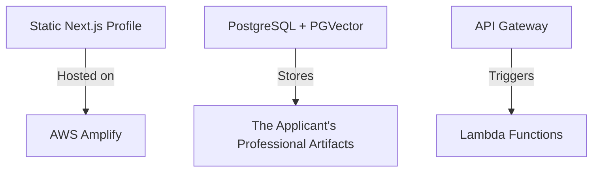
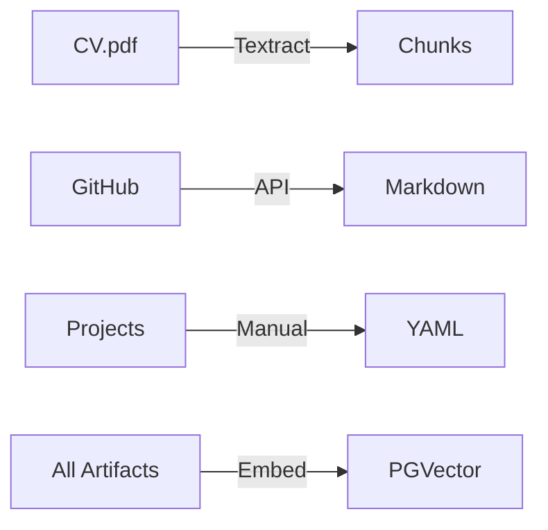
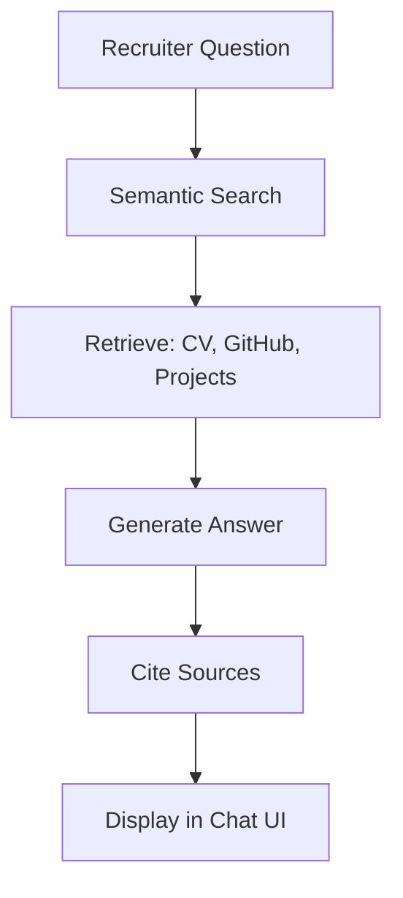

# AI-Powered Dynamic Professional Profile with RAG

## Overview

A serverless application that generates personalized hiring manager experiences by combining:

- **Retrieval-Augmented Generation (RAG)** for precise matching of Magnus's professional history
- Unique access links with AI-generated third-person introductions
- Cost-optimized AWS serverless infrastructure

## Key Features

✅ **RAG-Powered Personalization**

- Semantic search across the applicant's professional artifacts (CV, GitHub, projects)
- Always references the most relevant achievements for each job

✅ **Virtual Professional Advocate**

- AI speaks in third-person: "Bob's work on [Project X] demonstrates..."
- Subtly showcases technical capabilities through the system itself

✅ **Future Chat Feature**

- Recruiters can ask questions about applicant's experience
- Answers generated via RAG with source citations
- Privacy-protected (only public artifacts referenced)

## MVP Phases

### Phase 1: Core Infrastructure (Week 1-2)



**Tasks:**

1. Set up Amplify hosting for static profile
2. Configure RDS PostgreSQL with PGVector extension
3. Deploy base API Gateway + Lambda skeleton

### Phase 2: Knowledge Base Setup (Week 3)



**Artifact Processing:**

1. **Ingestion**:
   - PDFs → AWS Textract
   - GitHub → API scraper
   - Manual entries → Structured YAML
2. **Chunking**:
   - 500-token segments with metadata (source, date)
3. **Embedding**:
   - AWS Titan Embeddings (free tier)
   - Store in PGVector with cosine similarity index

### Phase 3: RAG Integration (Week 4-5)

**Flow:**

```python
def generate_response(token):
    # Retrieve job context
    job_desc = db.get_job_description(token)

    # RAG retrieval
    query = f"Relevant experience for: {job_desc}"
    results = vector_search(query, limit=3)

    # AI generation
    prompt = f"""
    As Bob's advocate, highlight his fit for this role using:
    {results}
    """
    return ai.generate(prompt)
```

## Future Roadmap

### Recruiter Chat Feature



**Implementation Notes:**

1. **Database Additions**:

   ```sql
   CREATE TABLE chat_sessions (
       session_id TEXT PRIMARY KEY,
       token TEXT REFERENCES recruiter_access(token),
       history JSONB
   );
   ```

2. **Privacy Controls**:
   - Automatic filtering of non-public artifacts
   - Optional manual answer approval workflow

## Tech Stack

| Component  | Technology            | Cost Consideration      |
| ---------- | --------------------- | ----------------------- |
| Frontend   | Next.js (Amplify)     | Free tier eligible      |
| Vector DB  | PostgreSQL + PGVector | RDS Free Tier (750 hrs) |
| Embeddings | AWS Titan             | Free ≤1M tokens/month   |
| API        | Lambda + API Gateway  | Always Free tier        |
